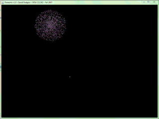
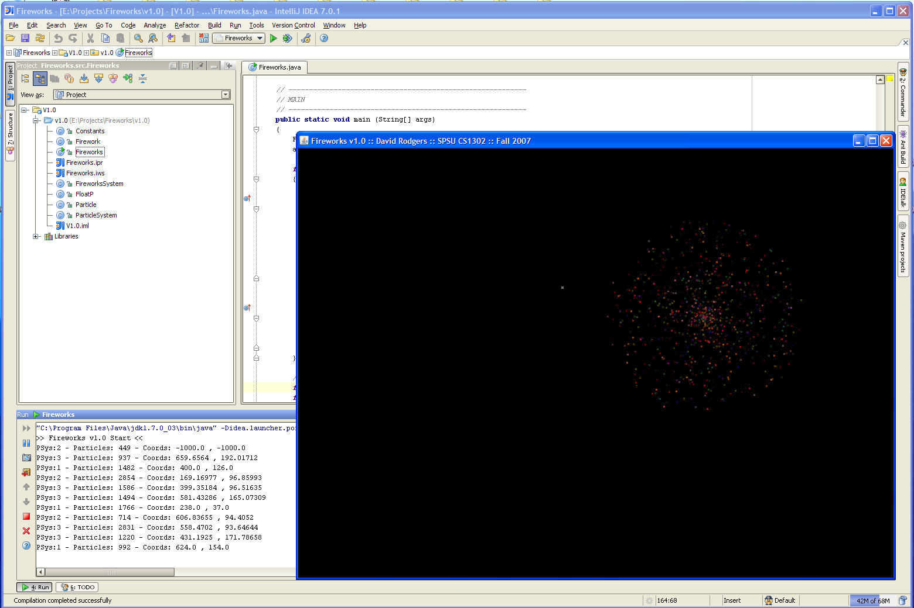

# Fireworks: A Basic Java Particle System

  

# Description
Typically the particle system’s position in 2D/3D space or motion therein is controlled by what is called the emitter. The emitter is mainly characterized by a set of particle behavior parameters and a position in 2D/3D space. The particle behavior parameters might include spawning rate (how many particles are generated per unit of time), particle initial velocity vector (i.e.- which way will it go when it is emitted), particle life (how much time does each individual particle live before being extinguished), particle color, variations throughout its life, and possibly many more. It is common for all, or most of, these parameters to be fuzzy, in the sense that instead of absolute values, some central value and allowable random variation is specified.

A typical particle system update loop (which is performed for each frame of animation) can be separated into two distinct stages, the parameter update/simulation stage and the rendering stage.

During the simulation stage, the number of new particles that must be created is calculated based on spawning rates and intervals between updates.  Each particle is spawned in a specific position in 2D/3D space based on emitter position and specified spawning area. Also, each of the particle’s parameters, like velocity, color, life, etc., is initialized based on the emitter’s parameters. After this is completed, all existing particles are checked to see if they have exceeded their lifetime, in which case they are removed from the simulation. Otherwise, their position and other characteristics are modified based on some sort of physical simulation, which can be as simple as adding the velocity to the current position, accounting for friction by modulating the velocity, or as complicated as performing physically accurate trajectory calculations taking into account external forces. 

A particle system has its own rules that are applied to every particle. Often these rules involve interpolating values over the lifetime of a particle. For example, many systems have particles fade out to nothingness by interpolating the particle’s alpha value (opacity) during the lifetime of the particle.

After the update is complete, each particle is usually rendered in the form of a textured bill-boarded quad (i.e.- a quadrilateral that is always facing the viewer). However, this is not necessary as the particle may be rendered as just a single pixel in low resolution/limited processing power environments.

# Screenshots

  

# Copyright

This project is distributed under the **MIT License**. Please see the included **COPYRIGHT** and **LICENSE** for more information.